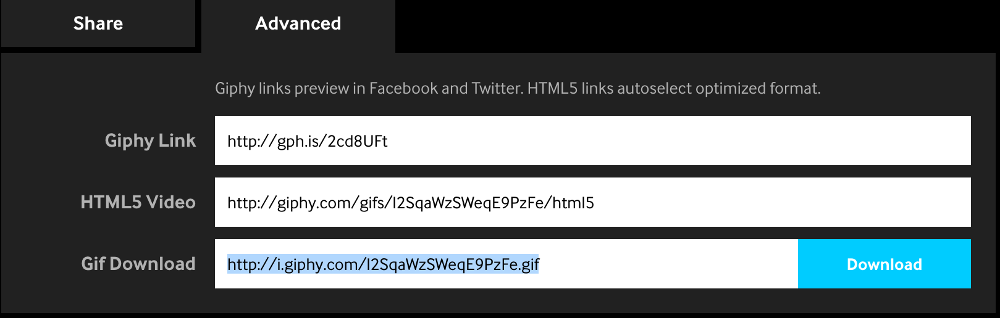

# Neighborhood Map
The Neighborhood Map displays mine and my husbands (Kathi & KJ) favorite locations in NYC. It is great for visitors who like our recommendations. With this app they can get a visual overview and filter our favorites according to their needs.

## About the app
The neighborhood map is built using Knockout.js for data binding and utilizes various APIs. The used APIs are:
- Google Maps
- Giphy (for displaying GIFs that are highly relevant and amusing to the user)
- FourSquare (to show more details about the specific locations)
- Yr.no (to show the current weather in NYC)

## How to contribute to this project
1. Check out the repository
2. To add location data to the model you have to keep the following format:

    ```javascript
    {
      title: 'MY LOCATION TITLE',
      query: 'MY+LOCATION+TITLE',
      tags: 'coffee, muffins, yoga, whatever, you, want', // used in the filter
      position: {lat: LOCATION_LAT, lng: LOCATION_LNG},
      description: 'describe your location here in your own words',
      iconImage: 'IMG_USED_FOR_MAP_ICON',
      searchTerm: 'search+term+for+Giphy',
      gif: 'find a giphy link for the default gif to be shown',
      id: 'find the google id for the location',
      liked: false,
      owner: 'Kathi, KJ' // (or only one of them)
    }
    ```
    
3. You can obtain the lat, lng and place id from [here](https://google-developers.appspot.com/maps/documentation/utils/geocoder/)
4. You can search for you favorite default GIF [here](http://giphy.com/). I recommend testing the searchTerm as well so it gives you automatic results for gifs that you like. You need to use the `http://i.giphy.com/GIPHY_ID.gif` format for the GIF link. You can get that link for a Giphy GIF when you go to YOUR_GIF_ON_GIPHY --> Advanced --> Gif download.


5. Remember that the `query` (for FourSquare) as well as the `searchTerm` (for Giphy) need to be words connected with plus signs and no spaces in between.
6. To optimize the CSS, JS and HTML files, you need to install [grunt](http://gruntjs.com/installing-grunt), as well as all packages used in **Gruntfile.js**. After that optimize the JS, CSS and HTML files with 

  ``` bash
  $> cd /path/to/your-project-folder/
  $> grunt
  ```
7. Update gh-pages to only contain dist:

  ``` bash
  $> cd /path/to/your-project-folder/
  $> git push origin `git subtree split --prefix dist master`:gh-pages --force
  ```

  
## TO DO / Collaboration sought to do
* The GIfs tend to repeat themselves even after you click on them (which should change the GIF). It would be nice to check that the next GIF is not the same as the previous one, or even keep a longer history of GIFs. Alternatively Giphy TV might be an option to consider.
* Sort the list of locations alphabetically?
* Add more tags such that the search will work better.
* Improve the search input for the mobile version, add an X which will delete all input.
* Add a clear button to clear all filters
* Add flickr images to the infowindow and implement a rotator, such that the user can rotate through all images.
* In that case, maybe put the google street view in a modal, it might be more useful that way since it will show more too.

## Author
The code is written by [Katharina Kufieta](https://www.linkedin.com/in/katharinakufieta).
